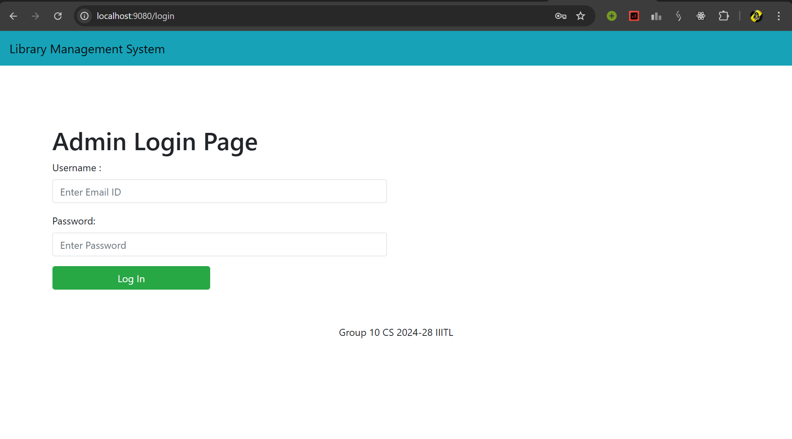
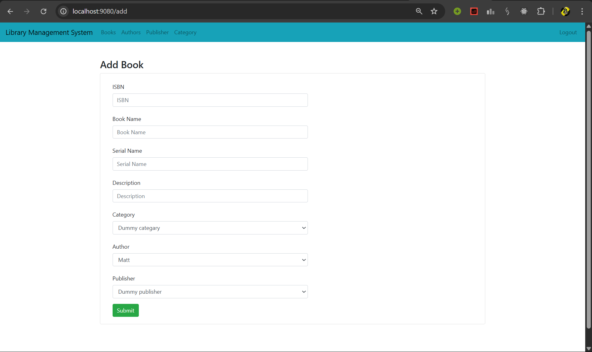
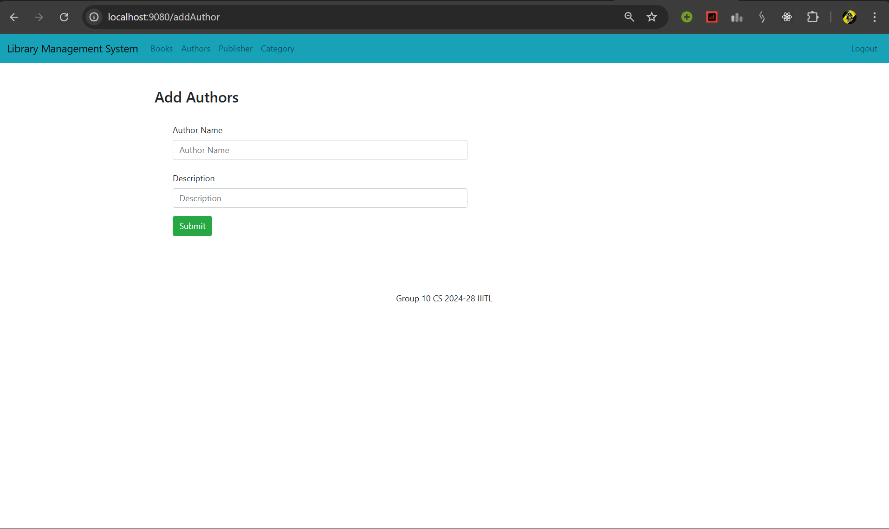
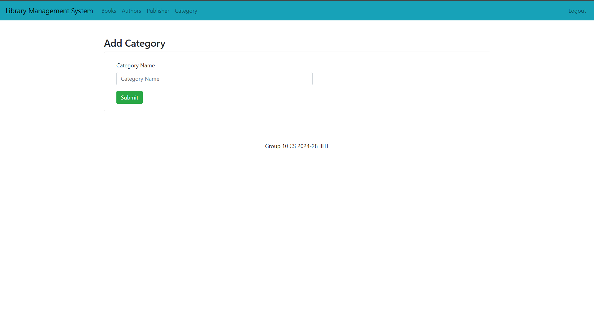
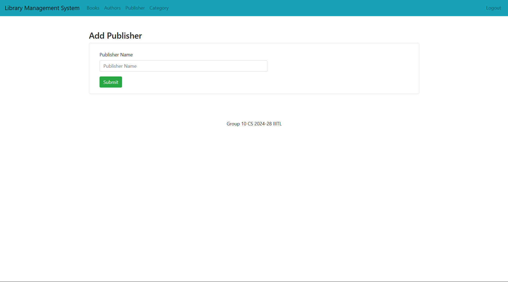

# Java, Spring Boot Capstone Project - Library Management System


# Local setup

Step 1: Download or clone the source code from GitHub to the local machine

Step 2: Install JDK 17 - https://www.oracle.com/java/technologies/javase/jdk17-archive-downloads.html

Step 3: Install IntelliJ IDEA or Eclipse or Apache NetBeans IDE

Step 4: Install Apache Maven - https://maven.apache.org/install.html

Step 5:  ```mvn clean install```

Step 6:  ```mvn spring-boot:run```

Step 7: From the browser call the endpoint http://localhost:9080

Step 8: Admin Login User Id: ```admin@admin.in``` & Password: ```Temp123```


# Admin Login Interface



# Add new books, update books, view books, delete books



# Add new authors, update authors, view authors, delete authors



# Add new categories, update categories, view categories, delete categories



# Add new publishers, update publishers, view publishers, delete publishers

